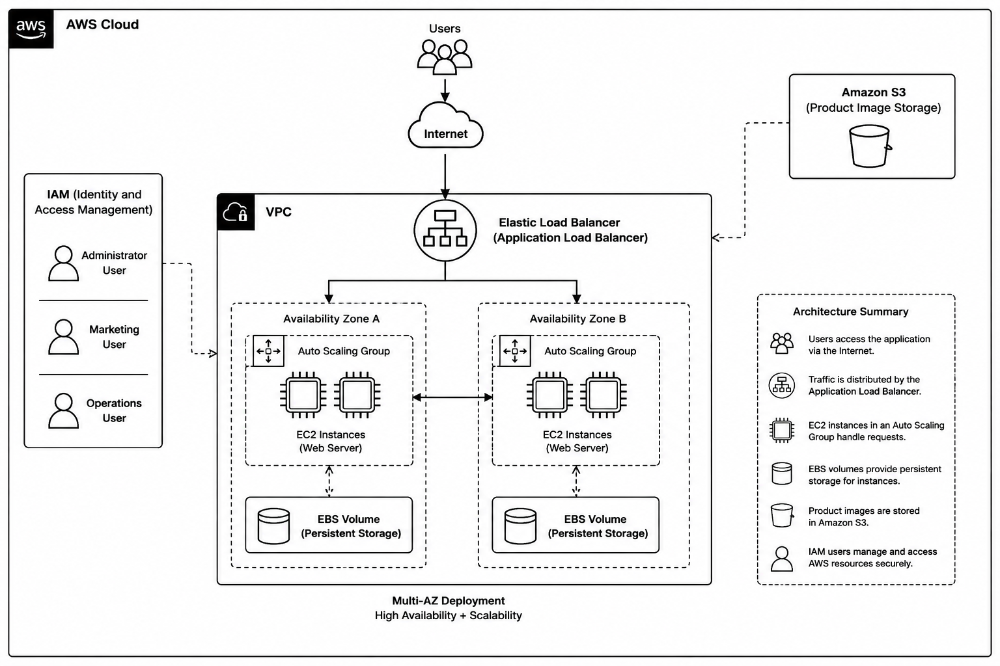

# AWS CCP Project – Oakline Market Infrastructure

## Overview

This project demonstrates the deployment of a secure, scalable, and highly available cloud infrastructure for Oakline Market using Amazon Web Services (AWS).

The solution was designed to support website hosting, product image storage, user access management, load balancing, and automatic scaling.

## AWS Services Used

* IAM (Identity and Access Management)
* Amazon S3
* Amazon EC2
* Amazon EBS
* Elastic Load Balancer (ELB)
* Auto Scaling Group (ASG)

## Project Tasks

### IAM

* Created Marketing User
* Created Operations User
* Created Administrator User
* Applied role-based permissions

### S3

* Created a bucket for product image storage
* Uploaded product images
* Configured bucket permissions

### EC2

* Launched a Linux EC2 instance
* Installed Apache Web Server
* Deployed a simple website

### EBS

* Created and attached an EBS volume
* Configured persistent storage

### ELB

* Configured an Elastic Load Balancer
* Distributed traffic across multiple EC2 instances

### ASG

* Created a Launch Template
* Configured an Auto Scaling Group
* Min Instances: 2
* Max Instances: 4

## Architecture

## Outcome

The project successfully delivered a secure, scalable, and highly available AWS infrastructure that meets Oakline Market's business requirements.

## Author

**Susan Orire**
